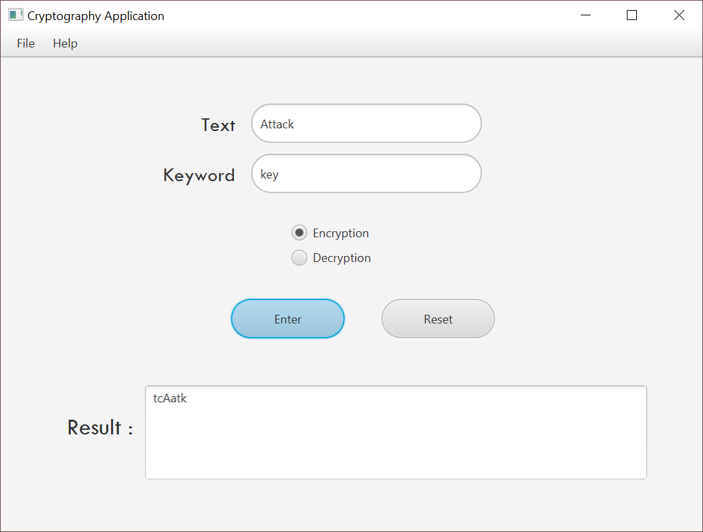

# Cryptography-Application
> Application for encrypt/decrypt text using Columnar Keyword Cipher

## User Manual
1. Enter your **plaintext** or **cipher text**
2. Enter the **key**
3. Choice the function type [ Encrypt OR Decrypt]

### Example

* Plaintext = Attack
* Key = key
* Function Type = Encrypt

**The Result**

